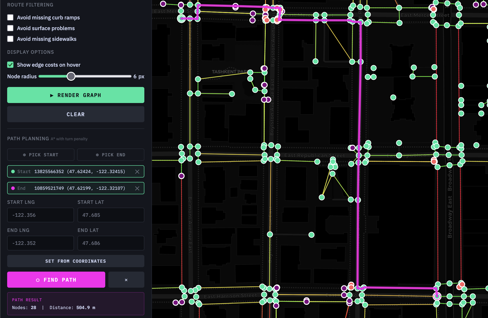
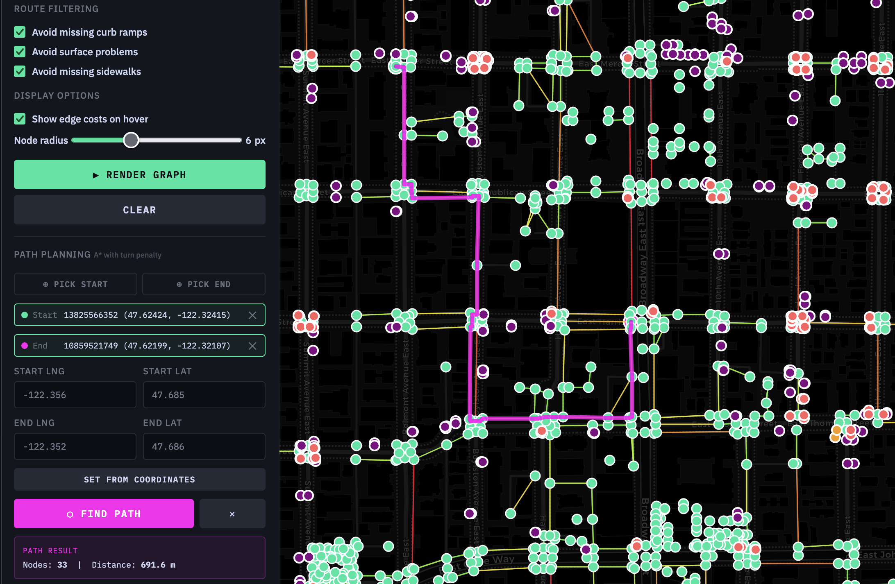
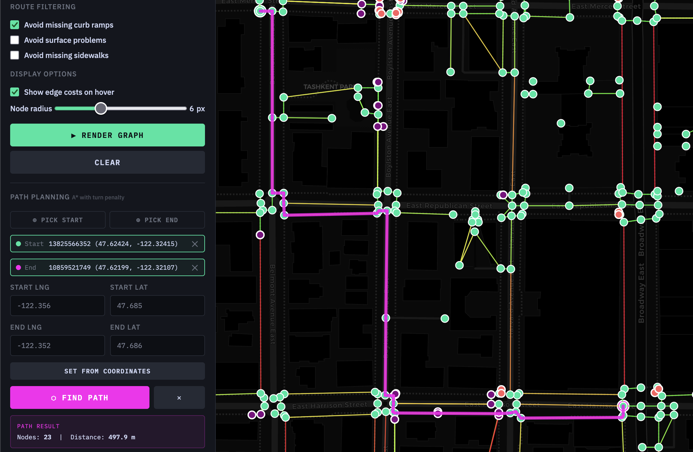
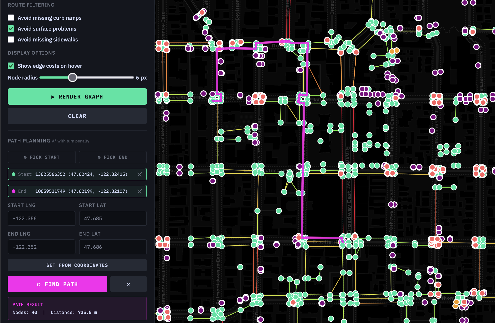
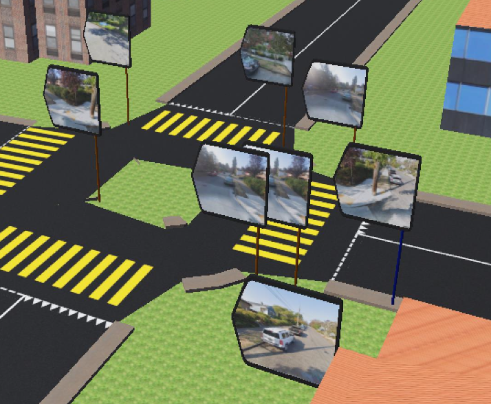
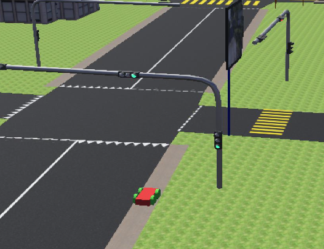
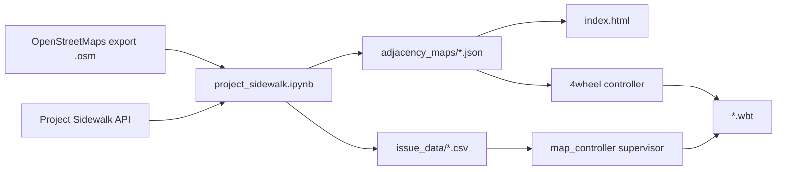

# Accessible Sidewalk Robot Simulation

Webots simulations of city sidewalks labeled with accessibility issues from the [Project Sidewalk](https://sidewalk-sea.cs.washington.edu/) API.

1. **Data pipeline** (`project_sidewalk.ipynb`) — fetches accessibility labels, builds a walkable graph from OpenStreetMap (OSM), and exports adjacency maps for navigation.
2. **Navigation Path Viewer** (`index.html`) — interactive Leaflet map for visualizing graphs and planning routes with filters for avoiding accessibility issues, useful for validating simulation behavior.

<table>
  <tr>
    <td></td>
    <td></td>
    <td></td>
    <td></td>
  </tr>
</table>


From left to right, path generation results for various acessibility issue avoidance restrictions:
| Filtering strategy         | # nodes in path | path length (m) | # edges in full graph |
| --------                   | -------         | -------         | -------               |
| All nodes allowed          | 28              | 504.9           | 13,421                |
| All issue nodes avoided    | 33              | 691.6           | 5,967                 |
| Missing curb ramps avoided | 23              | 497.9           | 8,941                 |
| Surface problems avoided   | 40              | 735.5           | 9,197                 |


3. **Webots simulation** (`sim_testing/`) — a four-wheeled robot navigating 3D sidewalk world imported from OSM, with markers for real-world accessibility issues.

<table>
  <tr>
    <td></td>
    <td></td>
  </tr>
</table>
Assessibility issues in Webots simulation world (left), robot at intersection (right).

## Overview



Export an OSM region → run the notebook to produce graph and issue files → interact with paths in the navigation viewer → run the Webots world with matching data files.

---

## Repository structure

```
.
├── README.md
├── pyproject.toml                Python dependencies (uv)
├── index.html                    Navigation Path Viewer (standalone)
├── project_sidewalk.ipynb        Main data pipeline
├── full_labels.json              Cached Project Sidewalk API response
│
├── adjacency_maps/               Generated navigation graphs (JSON)
├── assets/                       Street View images for marker sign boards in Webots simulation (generated)
│   └── {labelId}.jpg
├── issue_data/                   Accessibility issue coordinates (CSV)
├── osm_data/                     OSM exports
├── sim_testing/                    Primary Webots project
│   ├── worlds/
│   │   ├── small_map.wbt         Main simulation world
│   │   ├── 4_wheeled_robot.wbt   Robot test arena
│   │   └── small_map_net/        SUMO traffic network files (to simulate traffic)
│   ├── controllers/
│   │   ├── 4wheel/               Path-planning + navigation robot
│   │   ├── map_controller/       Webots world supervisor (spawns markers, tracks path)
│   │   └── crossroads_traffic_lights/
│   └── protos/                   Custom VRML protos (markers, robot, road)
└── supervisor_testing/             Webots supervisor demo
```
---

## Prerequisites

Python 3.10+ is required. Dependencies are managed with uv.

**Install uv**

**Create a virtual environment and install dependencies** from the repository root:

```bash
uv sync
```

**Activate the environment** and launch the notebook:

```bash
source .venv/bin/activate
jupyter notebook project_sidewalk.ipynb
```

**Select `.venv` as the notebook kernel** so cells run with the installed packages from the `pyproject.toml`

In VSCode, open `project_sidewalk.ipynb`, choose **Python Environments…** → **`.venv (Python 3.x)`**.

Install **[Webots R2025a](https://cyberbotics.com/)** to run simulations in the Webots environment.

---

## Generating adjacency maps

To create adjacency maps for the path viewer or Webots simulation:

1. [Export](https://www.openstreetmap.org/export) an OpenStreetMap segment and save it under `osm_data/` (e.g. `osm_data/capitol_hill.osm`).
2. Open `project_sidewalk.ipynb` and run cells in order from the repository root.

### Notebook cells

| Cell | Description | Outputs |
|------|-------------|---------|
| 1 | File paths to read/write from for data processing | N/A |
| 2 | Fetch Project Sidewalk labels for the OSM bounding box | `full_labels.json`, `raw_full_labels.json` |
| 3 | Download Google Street View images for each label (optional, for Webots sim) | `assets/{labelId}.jpg` |
| 4 | Convert labels to local tangent-plane coordinates | `issue_data/cp_translations.csv` |
| 5–6 | Build walkable graph from OSM, inject issue nodes, clean up graph | In-memory NetworkX graph |
| 7 | Export graph to JSON (and optionally CSV) | `adjacency_maps/big_test.json` |

Before running, update file paths in the first cell.

### Graph processing

The `parse_osm_file` function applies these steps:

- Keeps only walkable highway types: `footway`, `path`, `pedestrian`, `residential`, `living_street`, `service`
- Removes intersection-center nodes via DBSCAN clustering (`CLUSTER_THRESH_METERS = 20`)
- Removes statistical outlier nodes (±2σ from mean latitude/longitude)
- Merges nodes closer than ~3 m
- Projects accessibility issues onto the nearest walkable edge and splits edges at projection points
- Removes outlier-cost edges (> mean + 3σ)
- Computes edge costs as Manhattan distance × diagonal-turn penalty (1.0–2.0×)

Sets `lat_lng=False` in `parse_osm_file` when generating graphs for the Webots robot (tangent-plane coordinates in meters).

---

## Running the Webots simulation

1. Install Webots R2025a.
2. Open `sim_testing/worlds/small_map.wbt`.
3. Press **Play**.

The world was generated with the [OSM → Webots importer](https://cyberbotics.com/doc/automobile/open-street-map-importer) from `osm_data/small_map.osm`.


### What runs in `small_map.wbt`
| Component | Controller | Role |
|-----------|-----------|------|
| `map_supervisor` | `map_controller` | Loads accessibility markers from CSV; receives path waypoints from the robot |
| Four-wheeled robot | `4wheel` | Loads adjacency map, runs A\*, navigates waypoint-by-waypoint |
| Crossroad traffic lights | `crossroads_traffic_lights` | Drives LED states and broadcasts traffic state to the robot |

### Robot navigation (`4wheel.cpp`)

1. Loads an adjacency JSON and runs A\* between hardcoded start/end coordinates.
2. Sends each waypoint to the supervisor via an emitter.
3. `navToPoint()` drives the robot through a state machine: turn toward target → drive forward → obstacle avoidance → align to sidewalk (camera color segmentation) → wait at traffic lights.

### Supervisor (`map_controller.cpp`)

- Reads issue CSV and creates `SurfaceProblemMarker`, `NoCurbRampMarker`, or `NoSidewalkMarker` protos with Google Maps issue images from `assets/`.
- Receives path coordinates from the robot and highlights matching navigation poles in debug mode.

### Configuration before running
Change any hardcoded paths in the `.cpp` files and update start/end coordinates in `4wheel.cpp` if you change the map region:

```cpp
const Coord start = {52.6+OFFSET_X, -62.6+OFFSET_Y};
const Coord end   = {68.2+OFFSET_X, 101+OFFSET_Y};
```

### Coordinate transforms

The simulation uses a local tangent-plane coordinate system at the OSM map center. Shared constants across controllers and the notebook:

| Constant | Value | Meaning |
|----------|-------|---------|
| `OFFSET_X`, `OFFSET_Y` | 44.7, -122 | Transform between graph coords and Webots GPS |
| `LAT_CENTER` | 47.686 | Reference latitude |
| `gpsReference` (in `small_map.wbt`) | 47.686, -122.353 | World GPS anchor |